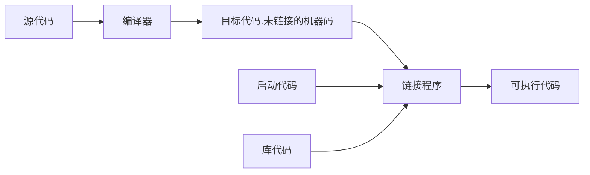

<!-- TOC -->

- [锚点](#锚点)
- [粗体斜体删除高亮](#粗体斜体删除高亮)
- [列表](#列表)
- [代码](#代码)
- [链接和图片](#链接和图片)
- [表格](#表格)
- [注释](#注释)
- [分割线](#分割线)
- [公式 CTRL M](#公式-ctrl-m)
- [**图**](#图)
- [快捷键](#快捷键)

<!-- /TOC -->
# 锚点

<a name="top"></a>

$$
\text{锚点制作：<a name="top"></a>}
$$
$$
\text{锚点引用[跳转到end](\#end)}
$$

[跳转到end](#end)  

# 粗体斜体删除高亮

**粗体** ctrl B

*斜体*

~~删除~~  

==高亮==

# 列表

* 我
   * 和IHAO 
      * 还好 
* 还好

# 代码

行内代码`int main(){}`

多行代码
```C
int main(){

}
```

# 链接和图片

[链接](https://chat.openai.com/)


# 表格

| 表头            | 表头 |
| :-:   | :-: |
|你好  | 你好hahahahahahahhahah|
|你好|  你好|

# 注释

<!-- 看不见 -->


# 分割线  
***
___
---

# 公式 CTRL M  
$ x^2 + y^2 = 1 $

多行公式
$$
\begin{vmatrix}
a_{11} & a_{12} & a_{13} \\
a_{21} & a_{22} & a_{23} \\
a_{31} & a_{32} & a_{33} \\
\end{vmatrix} = \text{det}(A)
$$

$$
\displaystyle\frac{x+1}{y+2}
\frac{x+1}{y+2}
$$
$$
\frac{x+1}{y+2}
$$

# **图**


# 快捷键

|快捷键|含义|
|:-:         |:-:|
|ctrl shift E|打开资源管理器|
|ctrl shift F|切换到繁体|
|ctrl N      |打开新文件|
|ctrl F      |查找|
|ctrl H      |替换|
|ctrl W      |关闭编辑器|
|ctrl B      |黑体/分割/切换侧边栏可见性|
|ctrl G      |按照行号跳转行|
|ctrl J      |打开/关闭终端|
|ctrl Z      |上一步|
|ctrl X      |删除行|
|ctrl M      |公式|
|ctrl -/+    |放大缩小|
|ctrl /      |改为/取消注释|
|ctrl \      |向右拆分|
|ctrl K, V   |侧边栏预览|
|ctrl T      |剪切|
|Tab         |接受建议|
|Esc         |拒绝建议|
|Ctrl + Enter|进入下一行|
|Alt + [或]  |上/下一条建议|
|Alt + \     |触发行内建议|


pdf书签需要pdf编辑器制作

<a name="end"></a>
[跳转到top](#top)